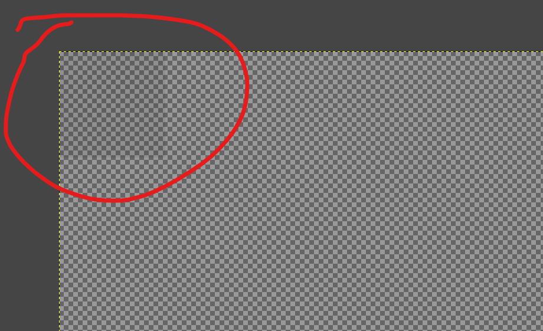

# CustomEscapeMenu
This resource pack allows you to create a completely custom escape menu for your server or adventure map using images!

## Changing Images
After unzipping the resource pack, go to the `assets/custom_escape/textures/escape_menu` folder.
The images in there can be changed to anything you want, although you should make sure to **edit the original images, and not create new ones yourself** for a few reasons. First, the images have to be exactly *255x150*px large, and all of them include two nearly invisible transparent gray squares in both top corners:

Those exist because minecraft doesn't recognize the actual width of a transparent image in a custom font by default, and adding them ensures that there are no issues with the placement of the image on the screen. The squares need to exist in every image to make sure it is properly placed. **So make sure to either use the original images or include them yourself!** Also make sure not to accidentally remove them while adding your own content to the image.

Now let's get to the actual files. You can find 4 .png files in the folder, with the following names:
- **logo.png**: The logo that will appear over the entire menu.
- **back_to_game.png**: The image that will replace the "back to game" button
- **quit.png**: The image that will replace the "Save and Quit to Title" / "Disconnect" button
- **bottom_card.png**: This image will be shown below the menu, and can be used to display additional information to players. If you don't want this card, you can leave the image empty (make sure to keep the squares).

Thanks to [**bug_finder**](https://github.com/BugFinderMC) for creating the Membercat-Themed example images!
